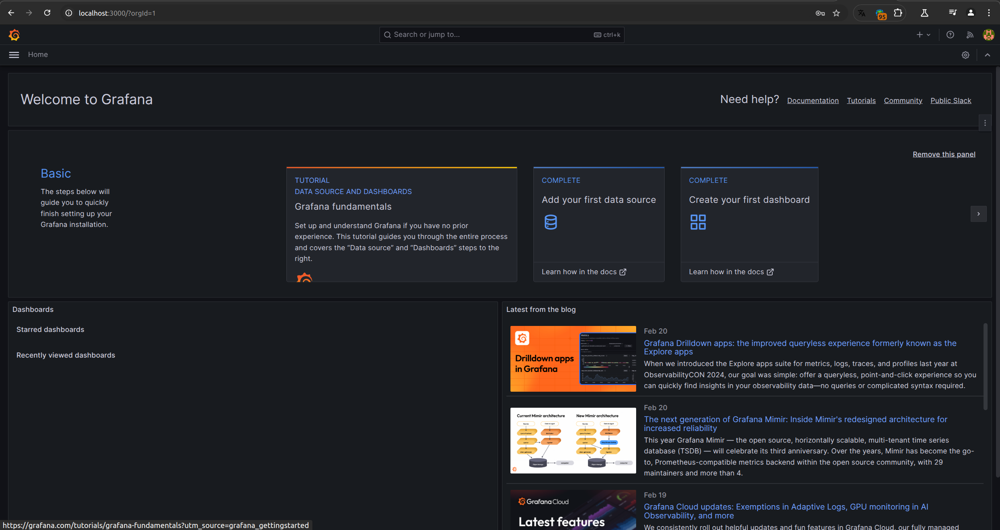
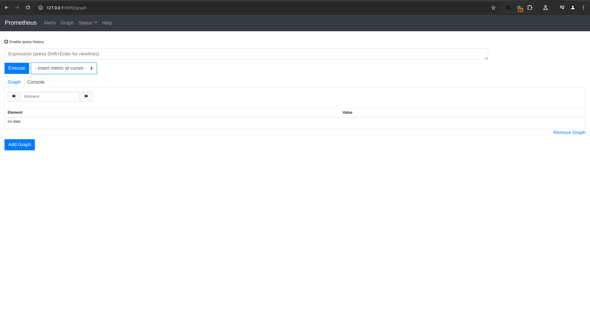
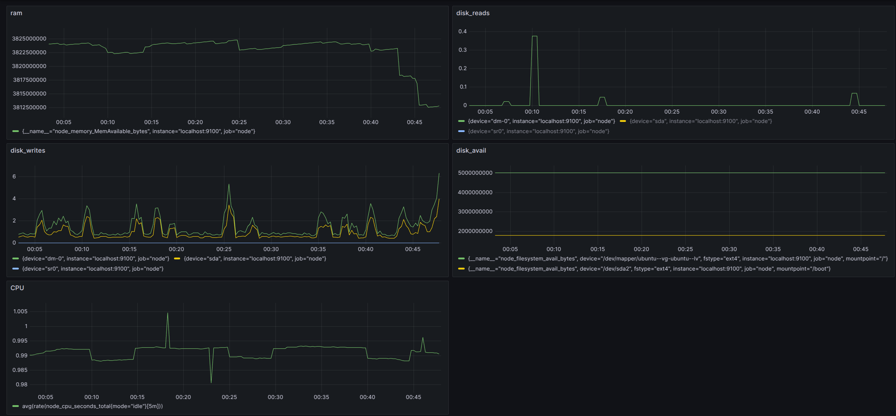
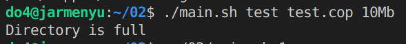
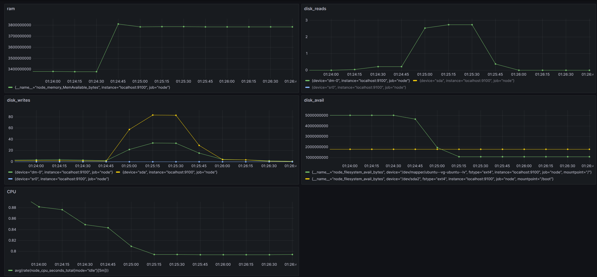
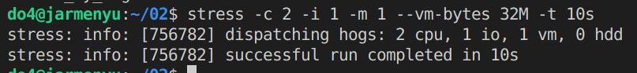
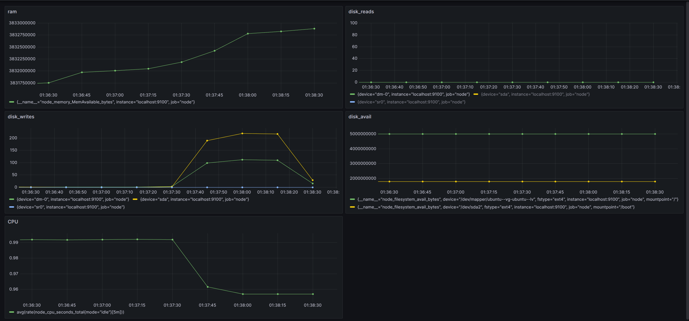

# Part 7. Prometheus и Grafana

Grafana port 3000 
 
Prometheus port 9090 
 
Добавить на дашборд Grafana отображение ЦПУ, доступной оперативной памяти, свободное место и кол-во операций ввода/вывода на жестком диске 
 
Запустить ваш bash-скрипт из part2 
Посмотреть на нагрузку жесткого диска (место на диске и операции чтения/записи) 
 
 
Посмотреть на нагрузку жесткого диска, оперативной памяти и ЦПУ stress -c 2 -i 1 -m 1 --vm-bytes 32M -t 10s 
 
 