# Part 8. Готовый дашборд

Установи готовый дашборд Node Exporter Quickstart and Dashboard с официального сайта Grafana Labs
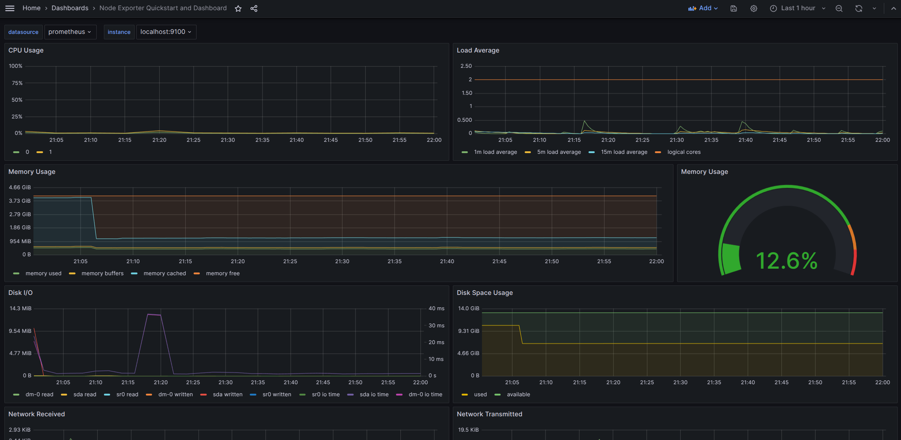   
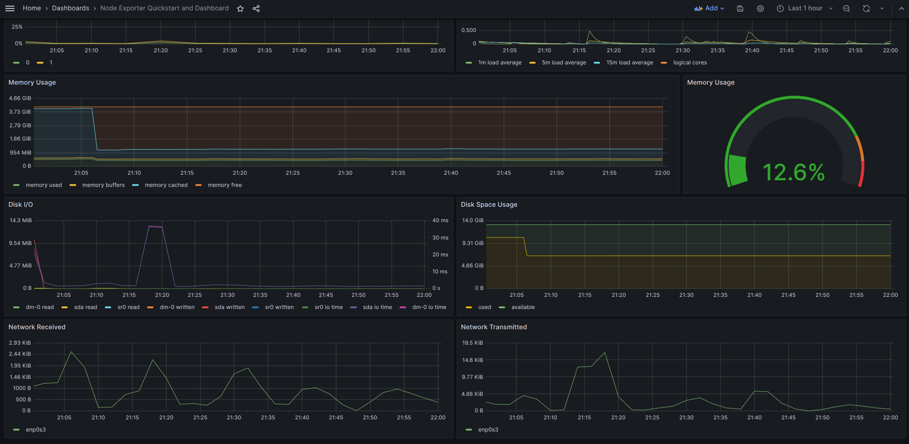  
Запустить ваш bash-скрипт из part2 
Посмотреть на нагрузку жесткого диска (место на диске и операции чтения/записи) 
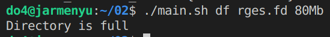 
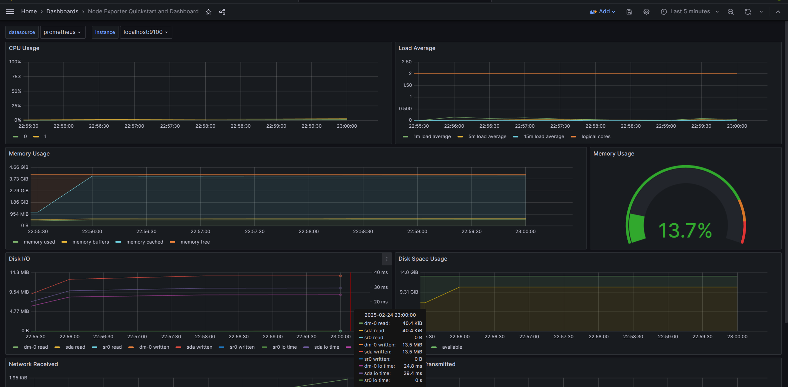 
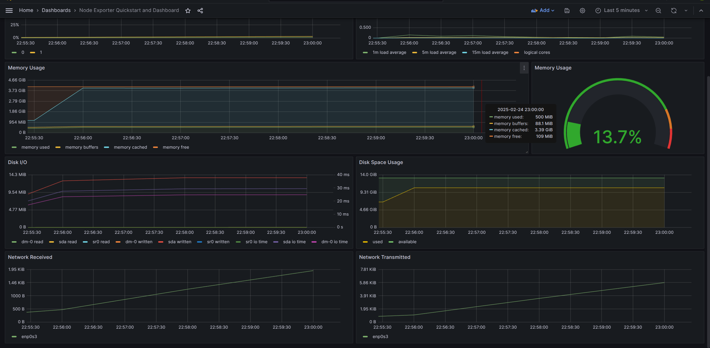 
Установи утилиту stress и запусти команду stress -c 2 -i 1 -m 1 --vm-bytes 32M -t 10s
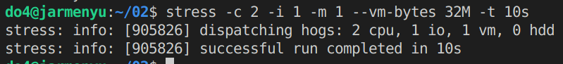 
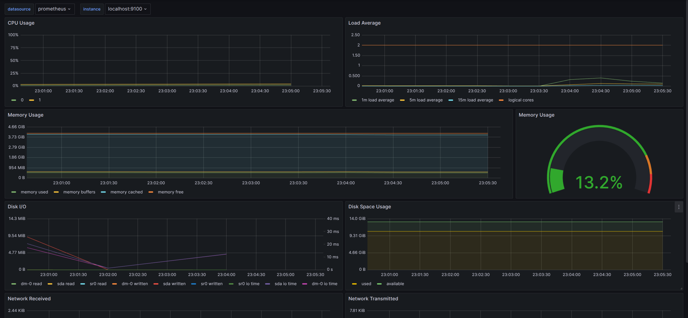 
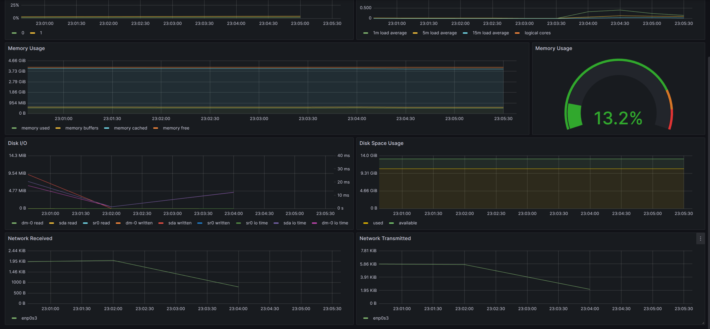 
Запусти ещё одну виртуальную машину, находящуюся в одной сети с текущей.
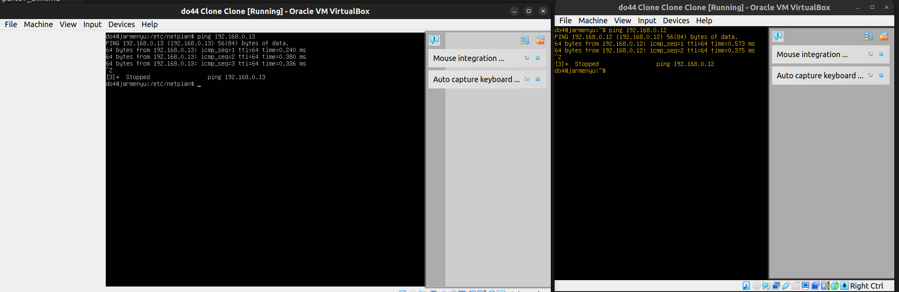 
Запусти тест нагрузки сети с помощью утилиты iperf3.
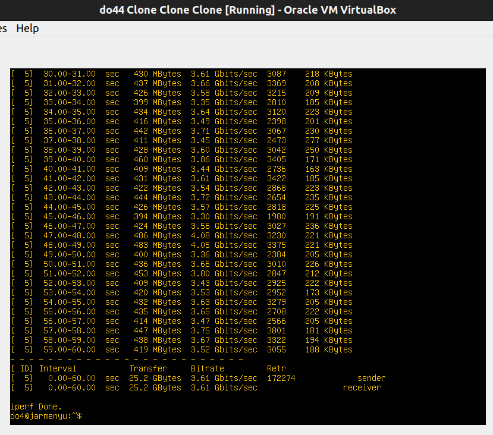 
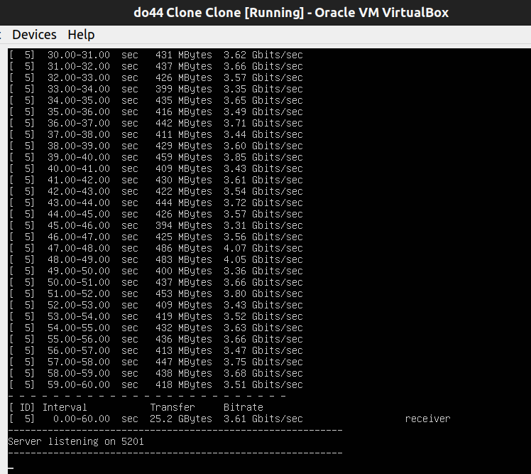 
Посмотри на нагрузку сетевого интерфейса.
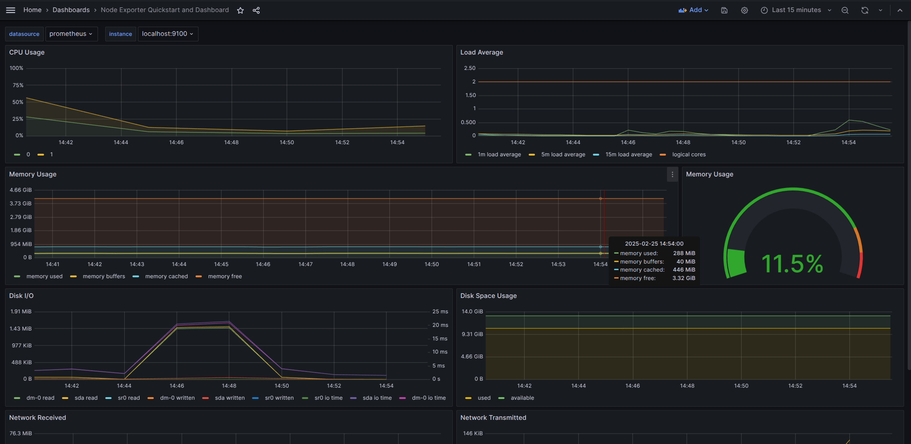 
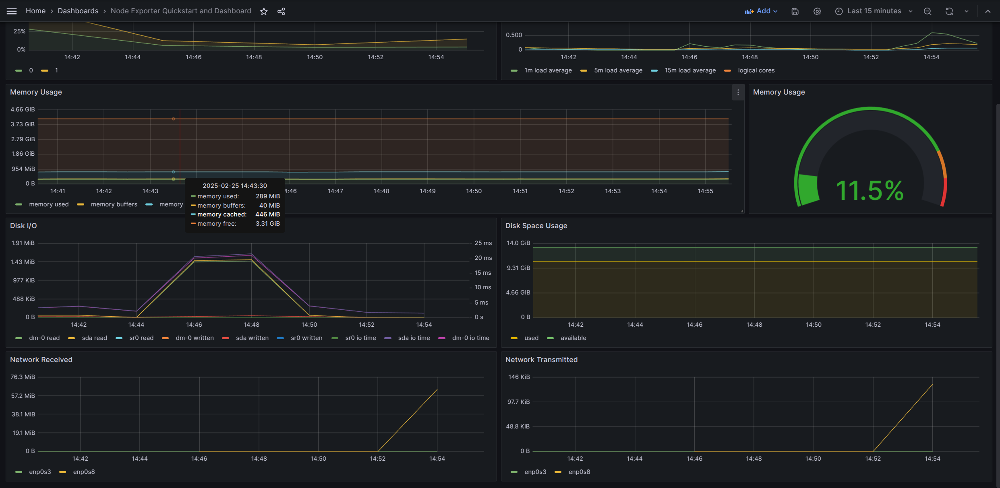 